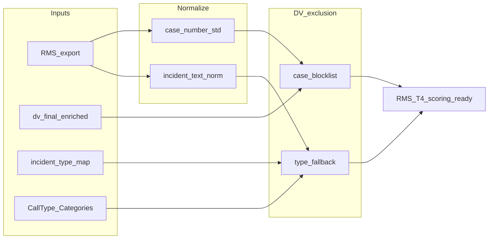

# T4 Hotspot RMS — DV exclusion plan

## Context locked in

- **[T4_Hotspot_Analysis_Master_Prompt_v3.md](C:\Users\carucci_r\OneDrive - City of Hackensack\10_Projects\Acute_Crime\T4_Hotspot_Analysis_Master_Prompt_v3.md)** defines RMS fields (`CaseNumber`, `IncidentType1/2/3`, `UCRCode`, address/date) and Tier 2 Part 1 scoring, but **does not** currently specify removing DV-tagged RMS rows. Adding DV exclusion keeps micro-place hotspoting aligned with **location/problem-solving** framing and reduces skew from household-intimate incidents (also consistent with Section 21 ethical framing: location/conditions, not persons).
- **CAD/RMS under `Acute_Crime/Data`:** Project docs ([README](C:\Users\carucci_r\OneDrive - City of Hackensack\10_Projects\Acute_Crime\README.md), [CHANGELOG v0.3.0](C:\Users\carucci_r\OneDrive - City of Hackensack\10_Projects\Acute_Crime\CHANGELOG.md), [SUMMARY](C:\Users\carucci_r\OneDrive - City of Hackensack\10_Projects\Acute_Crime\SUMMARY.md)) specify `Data/cad/monthly|yearly` and `Data/rms/monthly|yearly` XLSX layouts (2024–2026). **Verify on disk** before runs — some environments may not sync large binaries into the Cursor workspace index. TODO `confirm-rms-source` still applies: choose canonical input (local XLSX vs AGOL/GDB) per run.

## Upstream: [cad_rms_data_quality](C:\Users\carucci_r\OneDrive - City of Hackensack\02_ETL_Scripts\cad_rms_data_quality) — helpful for T4?

**Verdict: yes, as a pre-flight / source-of-truth layer — not as a replacement for T4 scoring or DV logic.**

That repo ([README](C:\Users\carucci_r\OneDrive - City of Hackensack\02_ETL_Scripts\cad_rms_data_quality\README.md), [CLAUDE.md](C:\Users\carucci_r\OneDrive - City of Hackensack\02_ETL_Scripts\cad_rms_data_quality\CLAUDE.md)) is the unified **CAD consolidation, ArcGIS Online publish path, gap/date fixes, geocoding/XY workflow**, and **monthly validation** stack tied to `09_Reference/Standards`. It aligns with T4’s own Data Quality checklist (master prompt §17) in several concrete ways:

| T4 concern | What `cad_rms_data_quality` offers |
|------------|-----------------------------------|
| **Wrong or estimated call dates** (breaks recency decay, time bins, cycle alignment) | Documented gap fixes, America/New_York handling, baseline FGDB with verified `calldate` (v1.6.1); nightly `Publish Call Data` pipeline restored (v1.7.1). |
| **Missing geometry / bad coordinates** | XYTableToPoint workflows, coordinate checks, geocode cache — supports Section 13 and §15.6 “no coordinate → flag”. |
| **Duplicate `ReportNumberNew`**, disposition noise, **HowReported** domain | [validation/](C:\Users\carucci_r\OneDrive - City of Hackensack\02_ETL_Scripts\cad_rms_data_quality\validation) orchestrator + validators (see [DOCUMENTATION_INDEX.md](C:\Users\carucci_r\OneDrive - City of Hackensack\02_ETL_Scripts\cad_rms_data_quality\validation\DOCUMENTATION_INDEX.md): `how_reported_validator`, `disposition_validator`, `case_number_validator`, `incident_validator`, `datetime_validator`, `geography_validator`). |
| **RMS required fields** (`CaseNumber`, dates, address, zone) | `python -m monthly_validation.scripts.validate_rms` and `config/rms_sources.yaml` per CLAUDE.md — catches bad rows **before** DV anti-join and Tier 2. |
| **Call-type drift** vs `CallTypes_Master` | Drift sync tooling under `validation/sync/` — same reference family T4 uses for whitelist/blacklist hygiene. |

**What it does *not* do for Acute_Crime:** it does not implement T4’s weighted scoring, self-initiated / Radio linkage rules, `Block_Final` normalization, precursor windows, or **DV exclusion** — those stay in the T4 pipeline (this plan + `dv_doj`).

**Recommended integration pattern for planning:**

1. **CAD input choice:** Prefer the **polished / published** CAD layer or baseline called out in that README (correct dates + geometry) over ad hoc raw Excel for the same window, when the analysis must match dashboards. If using a **fresh LawSoft export** instead, run **`validate_cad`** for the T4 pull month(s) and attach summary to the Data Quality Note.
2. **RMS input choice:** Run **`validate_rms`** on the RMS extract for the T4 window; fix or flag invalid `CaseNumber` formats **before** merging to the DV blocklist (same `YY-NNNNNN` idea as `dv_doj` / `case_number_validator`).
3. **Scope control:** Keep `cad_rms_data_quality` as **read-only dependency** (invoke validators or read their outputs); avoid duplicating consolidation logic inside `Acute_Crime` unless you later decide to merge repos.

## Chosen strategy (per your answer)

**Blocklist + fallback rules**: exclude an RMS row if **either**:

1. **Case blocklist** — `CaseNumber` (after the same normalization used in dv_doj) appears in the authoritative DV case set; **or**
2. **Type fallback** — any of `IncidentType1`, `IncidentType2`, `IncidentType3` (after lowercasing/trim and mapping through your reference tables) resolves to a **DV / domestic dispute** category, so gaps in the DV roster still get filtered.

## Source artifacts to reuse (no need to invent new semantics)

### A. DV case blocklist (T4 project + `dv_doj`)

| Artifact | Role |
|----------|------|
| [Data/dv_case_numbers_for_t4.csv](C:\Users\carucci_r\OneDrive - City of Hackensack\10_Projects\Acute_Crime\Data\dv_case_numbers_for_t4.csv) | **Production anti-join file for T4** — PII-safe (`case_number`, `source`, `source_date_end`); **1,536** rows; combines `dv_final_enriched` (through 2025-10-29) + PDF roster `2025_10_29_to_2026_04_16_DV_roster.pdf` (214 added); coverage **2023-01-01 → 2026-04-16** (as of 2026-04-16 handoff). **Use this path in code** unless refreshed. |
| [processed_data/dv_final_enriched.csv](C:\Users\carucci_r\OneDrive - City of Hackensack\02_ETL_Scripts\dv_doj\processed_data\dv_final_enriched.csv) | **Upstream** for blocklist build — full enriched DV rowset; do not copy wholesale into Acute_Crime (PII); blocklist CSV is the approved extract. |
| [reports/dv.csv](C:\Users\carucci_r\OneDrive - City of Hackensack\02_ETL_Scripts\dv_doj\reports\dv.csv), [reports/data/dv_high_risk_cases.csv](C:\Users\carucci_r\OneDrive - City of Hackensack\02_ETL_Scripts\dv_doj\reports\data\dv_high_risk_cases.csv), [arcgis_exports/.../dv_incidents_for_arcgis.csv](C:\Users\carucci_r\OneDrive - City of Hackensack\02_ETL_Scripts\dv_doj\arcgis_exports\dv_incidents_arcgis_ready\dv_incidents_for_arcgis.csv) | **Secondary / QA** — subsets; useful to verify counts vs `dv_final_enriched`, not ideal as sole blocklist. |
| [etl_scripts/backfill_dv.py](C:\Users\carucci_r\OneDrive - City of Hackensack\02_ETL_Scripts\dv_doj\etl_scripts\backfill_dv.py) — `standardise_case_number`, `CASE_PATTERN` (`^\d{2}-\d{6}$`) | **Normalization contract** — RMS `CaseNumber` must be stripped/uppercased and matched the same way before anti-join. |
| [etl_scripts/map_dv_to_rms_locations.py](C:\Users\carucci_r\OneDrive - City of Hackensack\02_ETL_Scripts\dv_doj\etl_scripts\map_dv_to_rms_locations.py) + [docs/mappings/location_join_keys.csv](C:\Users\carucci_r\OneDrive - City of Hackensack\02_ETL_Scripts\dv_doj\docs\mappings\location_join_keys.csv) | **Column-name pitfall** — DV pipeline RMS exports may use `Case Number` (space); T4 prompt uses `CaseNumber`. Plan: normalize column names to snake_case first, then one internal `case_number` key. |

### B. Incident-type fallback mapping

| Artifact | Role |
|----------|------|
| [docs/mappings/incident_type_map.csv](C:\Users\carucci_r\OneDrive - City of Hackensack\02_ETL_Scripts\dv_doj\docs\mappings\incident_type_map.csv) | Maps raw RMS-style strings (e.g. `domestic dispute`) to canonical/category — use rows where **category** or **canonical** indicates DV-adjacent incidents (e.g. `Domestic Dispute`, restraining-order violations if you choose to treat as in-scope). |
| [CallType_Categories.csv](C:\Users\carucci_r\OneDrive - City of Hackensack\09_Reference\Classifications\CallTypes\CallType_Categories.csv) | **CAD-oriented** labels (`Domestic Dispute`, `Domestic Violence - 2C:25-21`, variants) — use for **harmonizing strings** that appear in RMS `IncidentType*` text (often parallel naming), not as a second case list. |
| [09_Reference/Standards](C:\Users\carucci_r\OneDrive - City of Hackensack\09_Reference\Standards) — e.g. `CAD_RMS/DataDictionary` | **Field definitions and enums** — confirm official spellings/codes for RMS incident types and UCR when you extend fallback (optional: UCR/NIBRS family codes if you later add a third guardrail). |

## Implementation sketch (when you exit plan mode)

1. **Load `dv_case_blocklist`** — Prefer **`Data/dv_case_numbers_for_t4.csv`** → column `case_number` → `standardise_case_number()` (same regex as `dv_doj`). If rebuilding from scratch: derive from `dv_final_enriched` + supplements per handoff; log `source` / `source_date_end` counts.
2. **Normalize RMS** — snake_case columns; build `all_incidents` (per master prompt §3.4); normalize text for join to `incident_type_map.raw` (or fuzzy match if RMS has punctuation variants — start exact/lower strip).
3. **Apply exclusion mask** — `excluded = case_in_blocklist OR incident_matches_dv_category`; keep excluded rows in a side table for Data Quality Note (counts by reason: `dv_case_match` vs `type_fallback`).
4. **Wire into scoring** — run mask **before** Tier 2 Part 1 classification / precursor correlation so DV RMS rows do not inflate `rms_part1_count` or precursor flags. Re-read master prompt §12: precursor uses Part 1 RMS — ensure excluded DV rows never enter that pool.
5. **Optional copy into Acute_Crime** — If you want a portable project: copy **only** a minimal `dv_case_numbers_for_t4.csv` (one column + optional `source_file_date`) rather than full `dv_final_enriched.csv` to avoid **PII sprawl** ([dv_doj/docs/pii_policy.md](C:\Users\carucci_r\OneDrive - City of Hackensack\02_ETL_Scripts\dv_doj\docs\pii_policy.md)). Alternatively symlink or config path to `02_ETL_Scripts/dv_doj`.

## Blind spots and assumptions (read carefully)

- **Roster lag**: If `dv_final_enriched` is not regenerated on the same cadence as T4 RMS pulls, **new** DV cases may be missing from the blocklist until the DV ETL runs — the **type fallback** mitigates this but will not catch every edge spelling.
- **Over/under-exclusion**: Blocklist is precise per DV case file; type fallback may **rarely** catch a non-DV dispute labeled “domestic” in RMS — log these for manual review. Conversely, RMS entries with **no** domestic wording and **not** on the DV roster will **remain** (intended).
- **Tier 2 vs narrative**: Excluding DV reduces RMS Part 1 at residences; **public** Part 1 crimes remain. Confirm with command whether **any** Part 1 at a DV-flagged address should still count if the case is not DV-coded (blocklist is case-level, not address-level — good default).
- **CAD side**: Master prompt whitelist already focuses on street disorder; you may still want a parallel **CAD** domestic filter using `CallType_Categories` — **out of current RMS-only scope** unless you extend.
- **Data location**: Prefer a single canonical path per run (local `Data/` XLSX vs AGOL); avoid mixing raw export and dashboard layer without documenting the delta in the Data Quality Note.
- **Legal/PII**: Storing or emailing merged DV+RMS artifacts needs the same handling as the dv_doj project; prefer minimal derived files in T4.

## Suggested verification (after build)

- Count RMS rows before/after filter by `rms_pull` window; `% excluded` by reason.
- Spot-check 10–20 **excluded** case numbers in RMS source narrative (redacted workflow) vs **10 retained** assaults without DV tags.
- Cross-check distinct case count vs [Data/dv_case_numbers_for_t4.csv](C:\Users\carucci_r\OneDrive - City of Hackensack\10_Projects\Acute_Crime\Data\dv_case_numbers_for_t4.csv) row count and `source` mix; optional vs `dv_doj/reports/data/dv_flag_summary.csv` if maintained.

---

## 09_Reference/Standards — pre-build gates (Claude Code investigation)

Use **`current`** paths under [09_Reference/Standards](C:\Users\carucci_r\OneDrive - City of Hackensack\09_Reference\Standards) (not `archive/` copies) unless auditing history.

| Gate | Question | Verdict |
|------|------------|---------|
| **1** | RMS export column names and `CaseNumber` pattern? | **Closed** — [rms_export_field_definitions.md](C:\Users\carucci_r\OneDrive - City of Hackensack\09_Reference\Standards\RMS\DataDictionary\current\schema\rms_export_field_definitions.md): `CaseNumber`, `IncidentType1/2/3`, dates/times, `FullAddress`, `Zone`, `Grid`, `NIBRSClassification`, `TotalValueStolen`, `OfficerOfRecord`, `CaseStatus`, etc. Case number regex aligns with `dv_doj` (`^\d{2}-\d{6}([A-Z])?$` per Standards doc). |
| **2** | Sheet names / columns for cycle workbook? | **Inspection complete** (Claude Code) — **11 sheets**; **`09_Reference/Standards` still does not define** this file. **New finding:** `ReportName` is **`T4_Current` only** — **no** `T4_C01W02`-style cycle IDs in the workbook. **Pipeline blocker:** implement either a **date-range → cycle_id lookup** (cycle calendar), or **generate** `cycle_id` / labels from **Section 0 run parameters**; master prompt naming must stay consistent with command briefings. **Also:** column names use **spaces**; time fields may be **Excel serials** — normalize in code. Optional: promote structural dump to Standards (see subsection below). Todo `inspect-t4-master-workbook` → **done**; follow-up todo **`t4-cycle-id-strategy`**. |
| **3a** | Feb 2026 RMS file? | **Confirmed** — `2026_02_RMS.xlsx` is a **0-byte placeholder**; February RMS data **does not exist** in `Acute_Crime/Data`. |
| **3b** | DV roster / blocklist coverage? | **Closed for T4 anti-join (2026-04-16)** — [Data/dv_case_numbers_for_t4.csv](C:\Users\carucci_r\OneDrive - City of Hackensack\10_Projects\Acute_Crime\Data\dv_case_numbers_for_t4.csv): **1,536** unique `case_number` values, columns `case_number`, `source`, `source_date_end`. **Sources:** `dv_final_enriched.csv` (1,322 cases through **2025-10-29**) **+** PDF extraction from `2025_10_29_to_2026_04_16_DV_roster.pdf` (**214** additional cases). **Coverage span:** 2023-01-01 through **2026-04-16**. **Type fallback** remains recommended for RMS rows not yet on any roster. Ongoing: refresh this file when new DV PDFs/ETL drops arrive (`refresh-governance`). |
| **4** | Derive `UCRCode` / NIBRS from `IncidentType1` (master prompt §3.5)? | **Closed** — [rms_to_nibrs_offense_map.json](C:\Users\carucci_r\OneDrive - City of Hackensack\09_Reference\Standards\NIBRS\DataDictionary\current\mappings\rms_to_nibrs_offense_map.json) (~85 RMS incident types → NIBRS with confidence) plus [ucr_offense_classification.json](C:\Users\carucci_r\OneDrive - City of Hackensack\09_Reference\Standards\NIBRS\DataDictionary\current\schema\ucr_offense_classification.json) (NCIC ↔ NIBRS). No new mapping file required for baseline Tier 2 logic. |

**Additional Standards assets for T4 (beyond DV plan):**

| T4 need (master prompt) | Standards file |
|-------------------------|----------------|
| §6.3 HowReported / Radio vs self-initiated | [how_reported_normalization_map.json](C:\Users\carucci_r\OneDrive - City of Hackensack\09_Reference\Standards\CAD_RMS\mappings\how_reported_normalization_map.json) |
| §6.2 disposition exclusions | [disposition_normalization_map.json](C:\Users\carucci_r\OneDrive - City of Hackensack\09_Reference\Standards\CAD_RMS\mappings\disposition_normalization_map.json) |
| §5–6 call-type categories (programmatic whitelist/blacklist) | [CallType_Categories_latest.csv](C:\Users\carucci_r\OneDrive - City of Hackensack\09_Reference\Standards\CallType_Categories_latest.csv) — cross-check with `09_Reference/Classifications/CallTypes/CallType_Categories.csv` if both are maintained |
| §12 CAD–RMS linkage / precursor | [cad_to_rms_field_map.json](C:\Users\carucci_r\OneDrive - City of Hackensack\09_Reference\Standards\CAD_RMS\DataDictionary\current\schema\cad_to_rms_field_map.json) + [multi_column_matching_strategy.md](C:\Users\carucci_r\OneDrive - City of Hackensack\09_Reference\Standards\CAD_RMS\DataDictionary\current\schema\multi_column_matching_strategy.md) |
| §7.2 Part 1 / NIBRS Tier 2 | `ucr_offense_classification.json` (same as Gate 4) |
| §7.2 larceny threshold (`TotalValueStolen`) | Confirmed on RMS export in `rms_export_field_definitions.md` |

### After Gates 2 and 3 close: should findings live in `09_Reference/Standards`?

**Gate 2 (T4 Master workbook)** — **Yes, often worth adding** (optional but useful). Inspection yields **stable structural metadata**: workbook filename/version, sheet names, header row → logical field names (`cycle_id`, `ReportName`, 7-day/28-day columns). That is the same *kind* of knowledge Standards already holds for LawSoft exports (field dictionaries, mappings). A small **`Standards`-scoped** artifact closes the loop Gate 2 exposed: e.g. `T4/DataDictionary/current/t4_master_reporting_template_schema.md` plus optional `t4_cycle_workbook_headers.json` (or similar naming your repo prefers). **Requirements:** (1) treat it as **versioned** when `T4_Master_Reporting_Template.xlsx` changes; (2) keep **PII out** — structure only, no row data. **Alternative:** keep dumps only under `Acute_Crime/Docs/` if T4 is the sole consumer and you want zero Standards churn — less discoverable for other analysts.

**Gate 3 (data gaps)** — **Mostly no** as *Standards schema* content. Closing Gate 3 means **operational fixes** (re-export Feb RMS, regenerate DV roster) and **project-level notes** (README, `CHANGELOG`, `dv_doj`). Those are **incident-specific** or **pipeline state**, not reusable definitions. **Exceptions:** (1) if the org wants a **generic** “monthly RMS export validation checklist” in Standards, Gate 3 lessons can *inform* that doc; (2) if DV roster refresh becomes a **formal dependency** for multiple projects, a one-line **pointer** in Standards (“DV case blocklist refreshed via `dv_doj` — see …”) avoids magic paths — still owned by `dv_doj`, not duplicated data.

**Bottom line:** Promote **Gate 2 structure** to Standards when you want T4 cycle joins discoverable next to CAD/RMS/NIBRS. Keep **Gate 3 resolution** in project + ETL repos unless you are generalizing a reusable policy.

### `dv_doj` — roster export source and cleaning (documented where?)

**Answer: partially — workflow yes, single “system export name” line no.**

- [README.md](C:\Users\carucci_r\OneDrive - City of Hackensack\02_ETL_Scripts\dv_doj\README.md) describes the **end-to-end path**: Excel in `raw_data/xlsx/`, `python etl.py export` → CSV, `transform` / `map`, then **`backfill_dv`** with default inputs such as `processed_data/_2023_2025_10_31_dv_fixed_transformed_transformed.csv` and `raw_data/xlsx/output/_2023_2025_10_31_dv_rms.csv` / `_dv_cad.csv`, output e.g. `processed_data/dv_final.csv` and enriched variants. [docs/handoff_next_steps.md](C:\Users\carucci_r\OneDrive - City of Hackensack\02_ETL_Scripts\dv_doj\docs\handoff_next_steps.md) repeats the CLI order (export → profile → transform → map → verify).
- **Cleaning / validation** is implemented in code (`transform_dv_data.py`, `backfill_dv.py` — e.g. `standardise_case_number`, flags, RMS backfill) and policy in [docs/pii_policy.md](C:\Users\carucci_r\OneDrive - City of Hackensack\02_ETL_Scripts\dv_doj\docs\pii_policy.md). **`docs/source/README.md`** only references UCR PDF/DOCX forms, **not** the DV roster’s LawSoft export name.
- **Gap:** There is **no dedicated lineage doc** that states *which* RMS/LawSoft export or report produced the raw DV workbook on a given date. Filenames are **date-stamped** (e.g. `_2023_2025_10_31_`) implying a point-in-time pull, not live sync.

**Recommendation:** When the roster is regenerated, add **`dv_doj/docs/DATA_LINEAGE.md`** (or extend README): raw export identifier, pull date, transform chain, and path to `dv_final_enriched.csv` / blocklist date range (**actual max incident date**, not only `ValidationConfig.date_end`).

### Post–Gate 2 inspection: T4 `cycle_id` (design decision)

The workbook does **not** supply `T4_C01W02`-style identifiers — only **`T4_Current`** (per inspection). **Before build:** choose one approach (or hybrid): **(A)** maintain a **cycle calendar** (date ranges → `cycle_id`, `cycle_7day`, `cycle_28day`) in a controlled file or sheet; **(B)** **derive** labels from **Section 0 run parameters** and naming rules; **(C)** extend the Excel template (org process). Track as todo **`t4-cycle-id-strategy`**. This is **product/analyst policy**, not a Standards gap.

**Workbook cosmetic:** possible typo **`HourMinuetsCalc`** (and similar) — normalize via **snake_case** / alias map in code; do not rely on raw Excel header strings.

---

## Cursor / Claude Code handoff — 2026-04-16

Session output (doc + gate work + blocklist extraction):

- Project docs **README / CHANGELOG / SUMMARY / CLAUDE** aligned with master prompt and this plan.
- **Gates:** 1–4 closed per inspection; **Gate 3b** superseded by project blocklist file (above).
- **Blocklist:** [dv_case_numbers_for_t4.csv](C:\Users\carucci_r\OneDrive - City of Hackensack\10_Projects\Acute_Crime\Data\dv_case_numbers_for_t4.csv) — production **anti-join** input; details in **CLAUDE.md §4a, §6, §23**.
- **Blocker:** **`t4-cycle-id-strategy`** — master prompt cycle labels (`T4_C01W02`) not present in workbook (`T4_Current` only).
- **Still flagged:** `2026_02_RMS.xlsx` (0 bytes); **`confirm-rms-source`**; implement **`score-integration`** + **`type-fallback`** using Standards mappings.

---

## Documentation crosswalk (Claude Code project docs)

**Verification pass (2026-04-16, Claude Code):** Grep shows **no** stale `22 items` strings (only [CHANGELOG](C:\Users\carucci_r\OneDrive - City of Hackensack\10_Projects\Acute_Crime\CHANGELOG.md) describing the fix). Pre-flight wording: Master Prompt v3 §22 = **16** items; [CLAUDE.md](C:\Users\carucci_r\OneDrive - City of Hackensack\10_Projects\Acute_Crime\CLAUDE.md) §22 = **20** items (four DV/DQ extensions). `[NEEDS VERIFICATION]` for the cycle workbook was **removed** from README / CLAUDE / SUMMARY; active workbook is **`T4_Master_Reporting_Template.xlsx`** with **resolved path in CLAUDE.md §3** (`Documents\Projects\T4_New\T4_Master_Query\`; legacy `T4_Master.xlsm` archived per CHANGELOG).

**Second pass (filename consistency):** Across project docs **excluding** the frozen master prompt, remaining `T4_Master.xlsx` substring hits are **intentional only** — filename notes at top of README/CLAUDE, resolution bullets in Known Data Gaps / §24, and CHANGELOG history. **Zero orphaned actionable references** that would point implementers at the wrong file on disk. Scripts and runbooks must open **`T4_Master_Reporting_Template.xlsx`** per CLAUDE.md §3.

Core docs:

- [README.md](C:\Users\carucci_r\OneDrive - City of Hackensack\10_Projects\Acute_Crime\README.md)
- [CLAUDE.md](C:\Users\carucci_r\OneDrive - City of Hackensack\10_Projects\Acute_Crime\CLAUDE.md)
- [SUMMARY.md](C:\Users\carucci_r\OneDrive - City of Hackensack\10_Projects\Acute_Crime\SUMMARY.md)
- [CHANGELOG.md](C:\Users\carucci_r\OneDrive - City of Hackensack\10_Projects\Acute_Crime\CHANGELOG.md)

### Still open (implementation / data)

| Item | Status |
|------|--------|
| **`t4-cycle-id-strategy` (post–Gate 2)** | **Primary blocker** — no `T4_C01W02`-style IDs in workbook; choose calendar vs code-generated vs new sheet (options A–C above). Normalize Excel serial times and spaced headers; map typo fields (e.g. `HourMinuetsCalc`). |
| **`confirm-rms-source`** | Pending — canonical RMS input: local `Data/rms/` XLSX vs AGOL/GDB. |
| **Feb 2026 RMS (Gate 3a)** | 0-byte placeholder — re-export or document gap. |
| **DV blocklist → code** | Blocklist CSV **exists** (`blocklist-pipeline` done). **`score-integration`** must load it + apply exclusion before Tier 2 / precursor. |
| **`type-fallback`** | Pending — join `IncidentType*` to `incident_type_map` + DV-adjacent categories. |
| **UCRCode / NIBRS (Gate 4)** | **Closed in Standards** — implement reads from `rms_to_nibrs_offense_map.json` + `ucr_offense_classification.json`. |
| **`refresh-governance`** | Refresh `dv_case_numbers_for_t4.csv` when new DV PDFs or `dv_doj` outputs ship; document lineage. |
| **`dv_doj` lineage doc** | Optional `DATA_LINEAGE.md` in `dv_doj`. |
| **CAD-side DV filter** | Optional (CLAUDE §6.7). |

### Config / implementation

Point readers at **`T4_Master_Reporting_Template.xlsx`** (CLAUDE.md §3) for **context sheets**; **do not assume** the file provides `cycle_id` strings — implement **`t4-cycle-id-strategy`** first. Normalize time columns if stored as Excel serials.
